Apache Kafka для разработки и архитектуры

# Модуль 6. Kafka в production и интеграция Kafka с Big Data экосистемой

## Задание 1. Развёртывание и настройка Kafka-кластера в Yandex Cloud

### Шаг 1. Разворачивание и настройка кластера Kafka

1. Создан каталог для кластера

   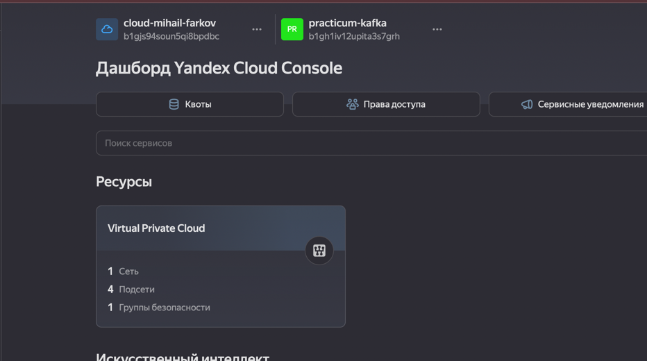

2. Выданы права доступа

   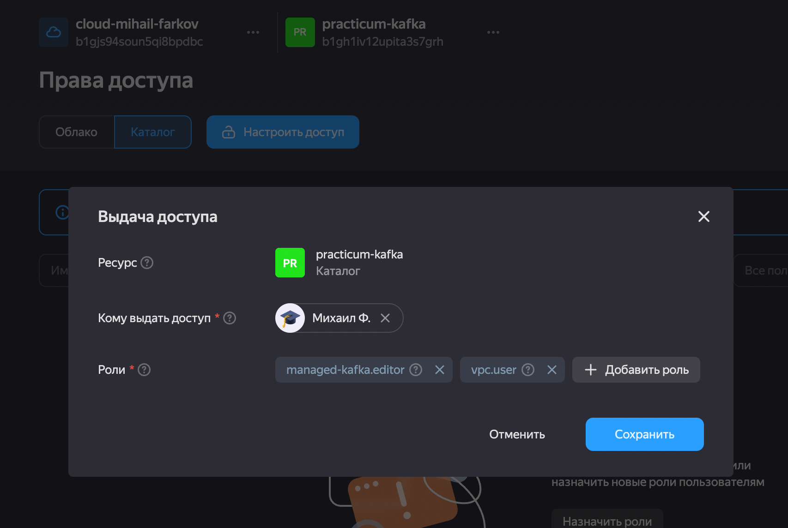

3. Создан кластер. Комбинированный Kraft. Реестр схем данных. Открытый публичный доступ

   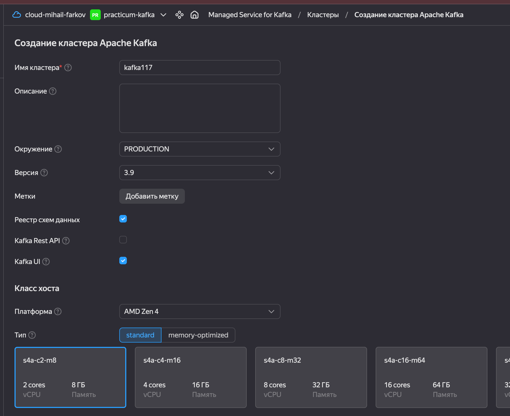
   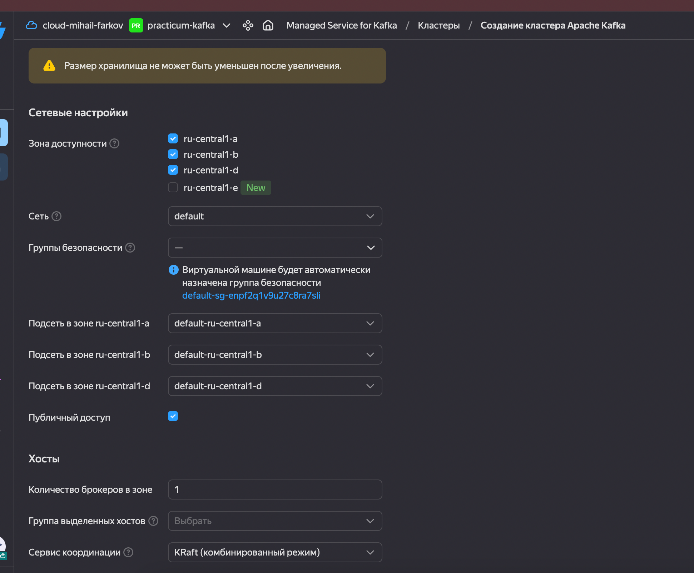
   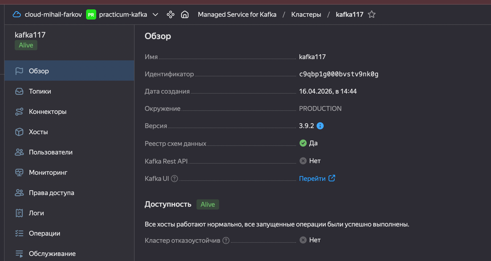

4. Создан пользователь для чтения/записи созданного топика
   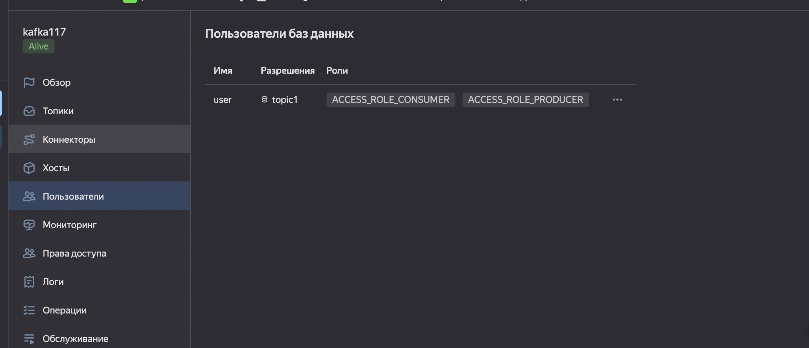

### Шаг 2. Настройте репликацию и хранение данных

Создан топик с 3 партициями и фактором репликации 3.
- log.cleanup.policy = delete
- log.retention.ms = 8640000
- log.segment.bytes = 268435456

  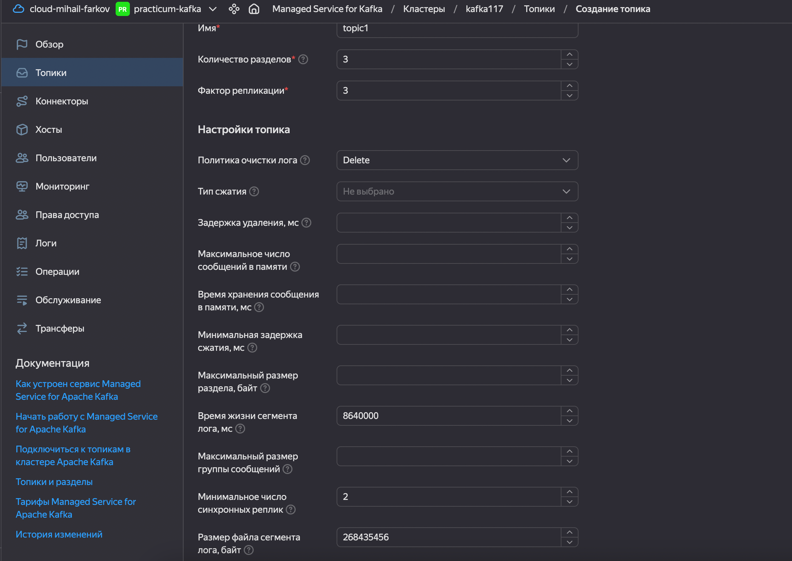
  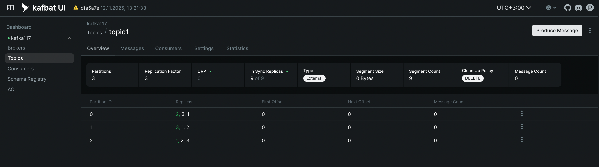

### Шаг 3. Настройте Schema Registry

Создана схема данных

```shell

curl -u "user:12345678" -X POST -k -H "Content-Type: application/vnd.schemaregistry.v1+json" \
  --data '{
    "schemaType": "JSON",
    "schema": "{\"$schema\":\"http://json-schema.org/draft-07/schema#\",\"title\":\"User\",\"type\":\"object\",\"properties\":{\"name\":{\"type\":\"string\"},\"email\":{\"type\":\"string\"},\"age\":{\"type\":\"integer\"}},\"required\":[\"name\",\"email\"]}"
  }' \
  https://rc1a-7t10rr3kj4vqej4u.mdb.yandexcloud.net/subjects/topic1-value/versions

{"id":1}

```

### Шаг 4. Проверьте работу Kafka.

1. Генерируем сообщение в топик

```shell
sudo docker compose run producer 
/usr/local/lib/python3.13/site-packages/authlib/_joserfc_helpers.py:8: AuthlibDeprecationWarning: authlib.jose module is deprecated, please use joserfc instead.
It will be compatible before version 2.0.0.
  from authlib.jose import ECKey
Сообщение: key='key-239f892d-3fa6-4b2f-bd80-6cf0e258fc00', user={'name': 'IsiLWnzodt', 'email': 'XwoEKEFV@yandex.ru'} отправлено в топик: topic1
```

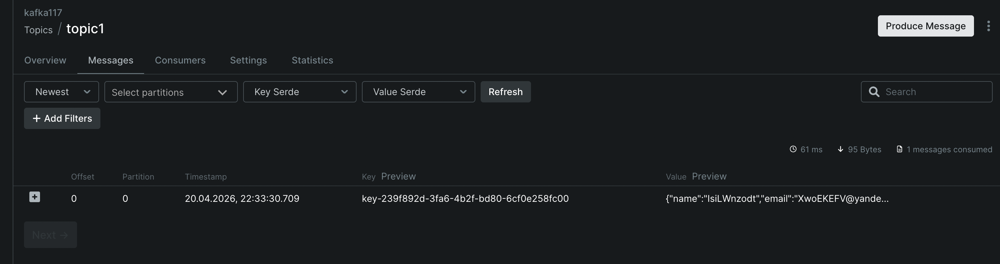

2. Читаем сообщение из топика

```shell
sudo docker compose run consumer  
/usr/local/lib/python3.13/site-packages/authlib/_joserfc_helpers.py:8: AuthlibDeprecationWarning: authlib.jose module is deprecated, please use joserfc instead.
It will be compatible before version 2.0.0.
  from authlib.jose import ECKey
Читаем топик: topic1
Получено сообщение: key='key-239f892d-3fa6-4b2f-bd80-6cf0e258fc00', user={'name': 'IsiLWnzodt', 'email': 'XwoEKEFV@yandex.ru'}, offset=0
```

## Задание 2. Интеграция Kafka с внешними системами (Apache NiFi / Hadoop)

1. Генерируем truststore для продюсера
```shell
keytool -import -alias kafka-root-ca -file py-test/ca.pem -keystore kafka-truststore.jks -storepass 12345678
```

2. Запускаем nifi
```shell
sudo docker compose up nifi
```

3. Создаём и настраиваем компонент на чтение csv файлов

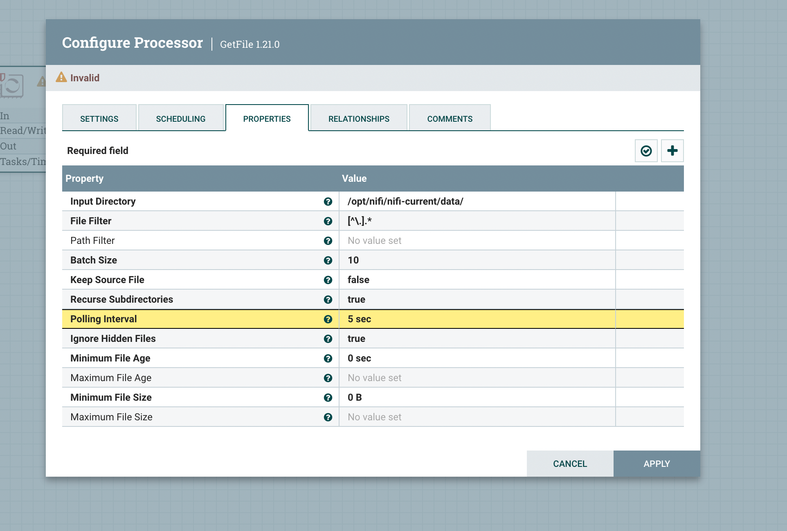

4. Создаём и настраиваем компонент на запись в Kafka кластер

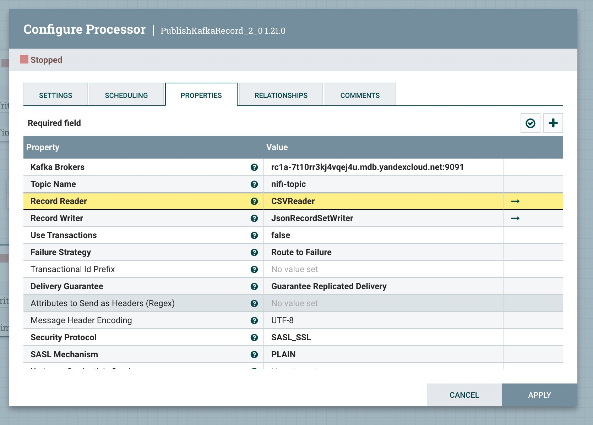

5. Создаём и настраиваем SSLContextService для работы с самоподписанным сертификатом кластера

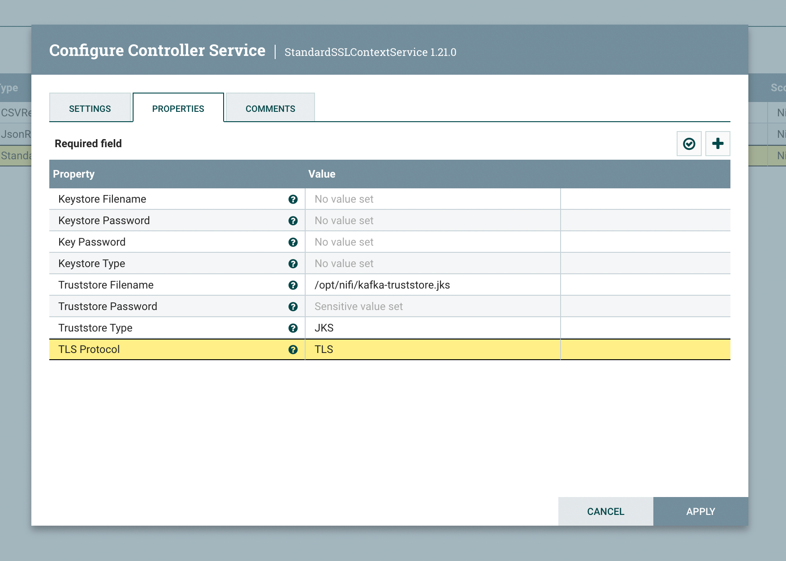

6. Валидируем и активируем SSLContextService и активируем Record Reader и Record Writer

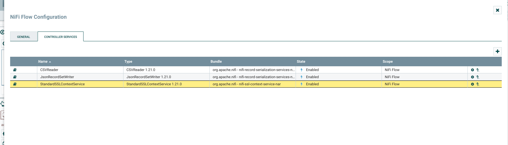

7. Запускаем пайплайн, проверяем логи на корректность работы и Kafka UI на наличие сообщений в целевом топике

```shell
nifi  | 2026-04-20 20:59:59,595 INFO [NiFi Web Server-25] o.a.n.c.s.StandardProcessScheduler Starting GetFile[id=acad189b-019d-1000-323d-000824a4f6e3]
nifi  | 2026-04-20 20:59:59,595 INFO [NiFi Web Server-25] o.a.n.controller.StandardProcessorNode Starting GetFile[id=acad189b-019d-1000-323d-000824a4f6e3]
nifi  | 2026-04-20 20:59:59,604 INFO [Timer-Driven Process Thread-8] o.a.n.c.s.TimerDrivenSchedulingAgent Scheduled GetFile[id=acad189b-019d-1000-323d-000824a4f6e3] to run with 1 threads
nifi  | 2026-04-20 20:59:59,624 INFO [Flow Service Tasks Thread-1] o.a.nifi.controller.StandardFlowService Saved flow controller org.apache.nifi.controller.FlowController@e8b4df3 // Another save pending = false
nifi  | tail: '/opt/nifi/nifi-current/logs/nifi-app.log' has been replaced;  following new file
nifi  | 2026-04-20 21:00:05,640 INFO [pool-7-thread-1] o.a.n.c.r.WriteAheadFlowFileRepository Initiating checkpoint of FlowFile Repository
nifi  | 2026-04-20 21:00:05,666 INFO [pool-7-thread-1] o.a.n.wali.SequentialAccessWriteAheadLog Checkpointed Write-Ahead Log with 1 Records and 0 Swap Files in 15 milliseconds (Stop-the-world time = 11 milliseconds), max Transaction ID 0
nifi  | 2026-04-20 21:00:05,666 INFO [pool-7-thread-1] o.a.n.c.r.WriteAheadFlowFileRepository Successfully checkpointed FlowFile Repository with 1 records in 15 milliseconds
nifi  | 2026-04-20 21:00:25,667 INFO [pool-7-thread-1] o.a.n.c.r.WriteAheadFlowFileRepository Initiating checkpoint of FlowFile Repository
nifi  | 2026-04-20 21:00:25,668 INFO [pool-7-thread-1] o.a.n.c.r.WriteAheadFlowFileRepository Successfully checkpointed FlowFile Repository with 1 records in 0 milliseconds
nifi  | 2026-04-20 21:00:44,286 INFO [Write-Ahead Local State Provider Maintenance] org.wali.MinimalLockingWriteAheadLog org.wali.MinimalLockingWriteAheadLog@446782b2 checkpointed with 2 Records and 0 Swap Files in 4 milliseconds (Stop-the-world time = 1 milliseconds, Clear Edit Logs time = 0 millis), max Transaction ID 1
nifi  | 2026-04-20 21:00:44,286 INFO [Cleanup Archive for default] o.a.n.c.repository.FileSystemRepository Successfully deleted 0 files (0 bytes) from archive
nifi  | 2026-04-20 21:00:44,286 INFO [Cleanup Archive for default] o.a.n.c.repository.FileSystemRepository Archive cleanup completed for container default; will now allow writing to this container. Bytes used = 38.13 GB, bytes free = 20.24 GB, capacity = 58.37 GB
nifi  | 2026-04-20 21:00:45,668 INFO [pool-7-thread-1] o.a.n.c.r.WriteAheadFlowFileRepository Initiating checkpoint of FlowFile Repository
nifi  | 2026-04-20 21:00:45,669 INFO [pool-7-thread-1] o.a.n.c.r.WriteAheadFlowFileRepository Successfully checkpointed FlowFile Repository with 1 records in 0 milliseconds
nifi  | 2026-04-20 21:00:51,238 INFO [Flow Service Tasks Thread-1] o.a.nifi.controller.StandardFlowService Saved flow controller org.apache.nifi.controller.FlowController@e8b4df3 // Another save pending = false


nifi  | 2026-04-20 21:01:05,670 INFO [pool-7-thread-1] o.a.n.c.r.WriteAheadFlowFileRepository Initiating checkpoint of FlowFile Repository
nifi  | 2026-04-20 21:01:05,670 INFO [pool-7-thread-1] o.a.n.c.r.WriteAheadFlowFileRepository Successfully checkpointed FlowFile Repository with 1 records in 0 milliseconds
nifi  | 2026-04-20 21:01:11,562 INFO [NiFi Web Server-22] o.a.n.c.s.StandardProcessScheduler Starting PublishKafkaRecord_2_0[id=acae483e-019d-1000-ceba-b57d1fc6738b]
nifi  | 2026-04-20 21:01:11,562 INFO [NiFi Web Server-22] o.a.n.controller.StandardProcessorNode Starting PublishKafkaRecord_2_0[id=acae483e-019d-1000-ceba-b57d1fc6738b]
nifi  | 2026-04-20 21:01:11,564 INFO [Timer-Driven Process Thread-7] o.a.n.c.s.TimerDrivenSchedulingAgent Scheduled PublishKafkaRecord_2_0[id=acae483e-019d-1000-ceba-b57d1fc6738b] to run with 1 threads
nifi  | 2026-04-20 21:01:11,575 INFO [Timer-Driven Process Thread-10] o.a.k.clients.producer.ProducerConfig ProducerConfig values: 
nifi  | 	acks = all
nifi  | 	batch.size = 16384
nifi  | 	bootstrap.servers = [rc1a-7t10rr3kj4vqej4u.mdb.yandexcloud.net:9091]
nifi  | 	buffer.memory = 33554432
nifi  | 	client.id = 
nifi  | 	compression.type = none
nifi  | 	connections.max.idle.ms = 540000
nifi  | 	enable.idempotence = false
nifi  | 	interceptor.classes = []
nifi  | 	key.serializer = class org.apache.kafka.common.serialization.ByteArraySerializer
nifi  | 	linger.ms = 0
nifi  | 	max.block.ms = 5000
nifi  | 	max.in.flight.requests.per.connection = 5
nifi  | 	max.request.size = 1048576
nifi  | 	metadata.max.age.ms = 300000
nifi  | 	metric.reporters = []
nifi  | 	metrics.num.samples = 2
nifi  | 	metrics.recording.level = INFO
nifi  | 	metrics.sample.window.ms = 30000
nifi  | 	partitioner.class = class org.apache.kafka.clients.producer.internals.DefaultPartitioner
nifi  | 	receive.buffer.bytes = 32768
nifi  | 	reconnect.backoff.max.ms = 1000
nifi  | 	reconnect.backoff.ms = 50
nifi  | 	request.timeout.ms = 30000
nifi  | 	retries = 0
nifi  | 	retry.backoff.ms = 100
nifi  | 	sasl.client.callback.handler.class = null
nifi  | 	sasl.jaas.config = [hidden]
nifi  | 	sasl.kerberos.kinit.cmd = /usr/bin/kinit
nifi  | 	sasl.kerberos.min.time.before.relogin = 60000
nifi  | 	sasl.kerberos.service.name = null
nifi  | 	sasl.kerberos.ticket.renew.jitter = 0.05
nifi  | 	sasl.kerberos.ticket.renew.window.factor = 0.8
nifi  | 	sasl.login.callback.handler.class = null
nifi  | 	sasl.login.class = null
nifi  | 	sasl.login.refresh.buffer.seconds = 300
nifi  | 	sasl.login.refresh.min.period.seconds = 60
nifi  | 	sasl.login.refresh.window.factor = 0.8
nifi  | 	sasl.login.refresh.window.jitter = 0.05
nifi  | 	sasl.mechanism = PLAIN
nifi  | 	security.protocol = SASL_SSL
nifi  | 	send.buffer.bytes = 131072
nifi  | 	ssl.cipher.suites = null
nifi  | 	ssl.enabled.protocols = [TLSv1.2, TLSv1.1, TLSv1]
nifi  | 	ssl.endpoint.identification.algorithm = https
nifi  | 	ssl.key.password = null
nifi  | 	ssl.keymanager.algorithm = SunX509
nifi  | 	ssl.keystore.location = null
nifi  | 	ssl.keystore.password = null
nifi  | 	ssl.keystore.type = JKS
nifi  | 	ssl.protocol = TLS
nifi  | 	ssl.provider = null
nifi  | 	ssl.secure.random.implementation = null
nifi  | 	ssl.trustmanager.algorithm = PKIX
nifi  | 	ssl.truststore.location = /opt/nifi/kafka-truststore.jks
nifi  | 	ssl.truststore.password = [hidden]
nifi  | 	ssl.truststore.type = JKS
nifi  | 	transaction.timeout.ms = 60000
nifi  | 	transactional.id = null
nifi  | 	value.serializer = class org.apache.kafka.common.serialization.ByteArraySerializer
nifi  | 
nifi  | 2026-04-20 21:01:11,792 INFO [Flow Service Tasks Thread-2] o.a.nifi.controller.StandardFlowService Saved flow controller org.apache.nifi.controller.FlowController@e8b4df3 // Another save pending = false
nifi  | 2026-04-20 21:01:11,808 INFO [Timer-Driven Process Thread-10] o.a.k.c.s.authenticator.AbstractLogin Successfully logged in.
nifi  | 2026-04-20 21:01:11,830 INFO [Timer-Driven Process Thread-10] o.a.kafka.common.utils.AppInfoParser Kafka version : 2.0.0
nifi  | 2026-04-20 21:01:11,831 INFO [Timer-Driven Process Thread-10] o.a.kafka.common.utils.AppInfoParser Kafka commitId : 3402a8361b734732
nifi  | 2026-04-20 21:01:12,700 INFO [kafka-producer-network-thread | producer-1] org.apache.kafka.clients.Metadata Cluster ID: 3GiRufETTkqrG5eGtuTENg
```

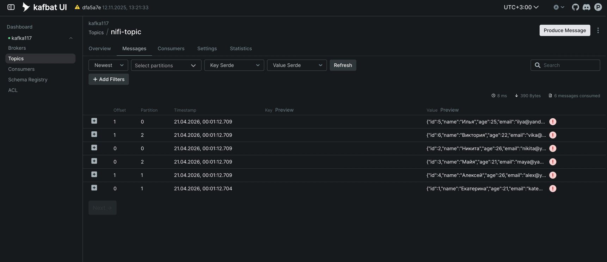